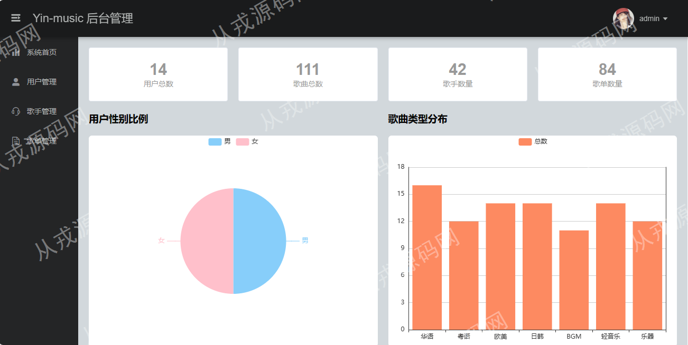
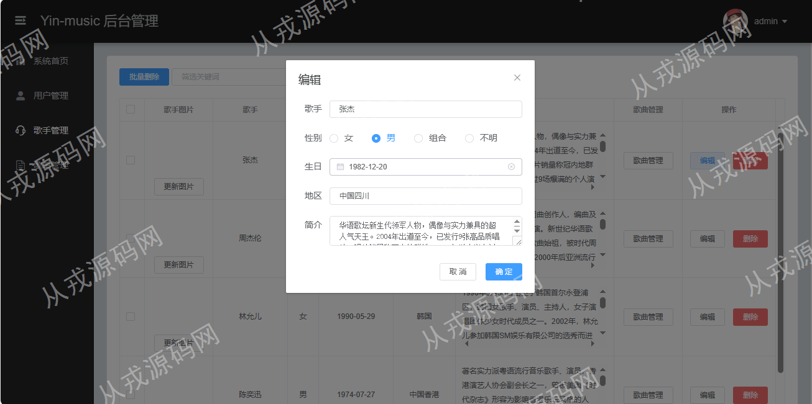
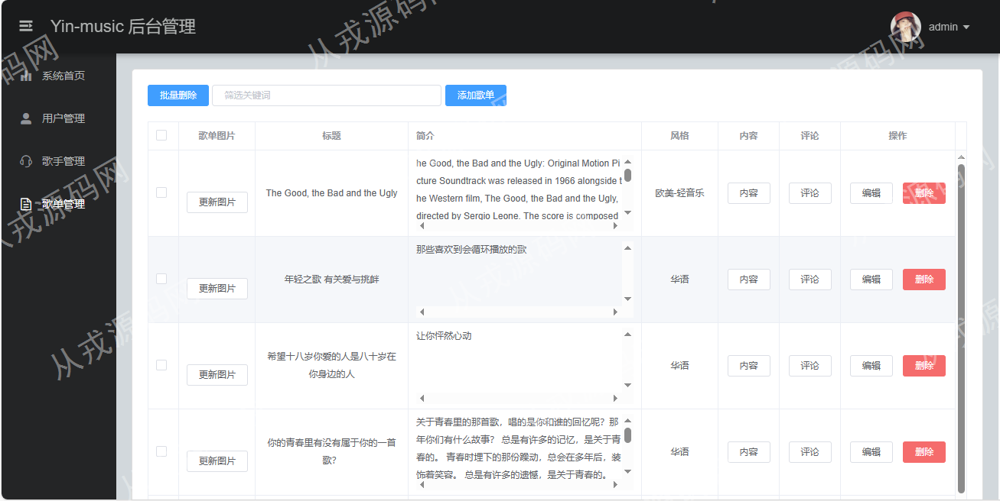
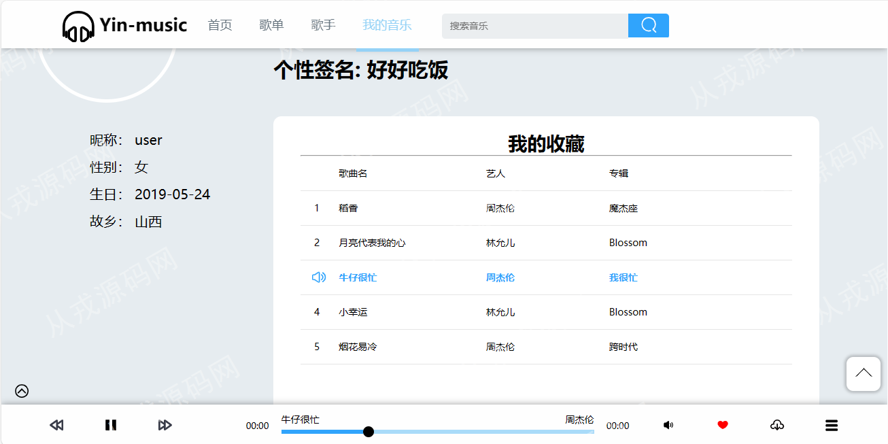
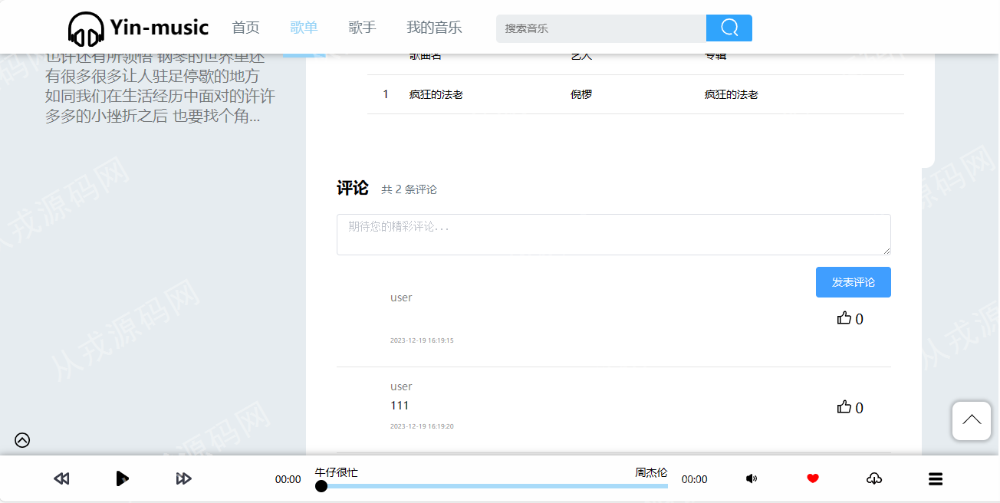

<h1 align="center">56.音乐播放平台管理系统</h1>

- <b>完整代码获取地址：从戎源码网 ([https://armycodes.com/](https://armycodes.com/))</b>
- <b>技术探讨、资料分享，请加QQ群：692619798</b> 
- <b>作者微信：19941326836  QQ：952045282</b> 
- <b>承接计算机毕业设计、Java毕业设计、Python毕业设计、深度学习、机器学习</b>
- <b>选题+开题报告+任务书+程序定制+安装调试+论文+答辩ppt 一条龙服务</b>
- <b>所有选题地址 ([https://github.com/YuLin-Coder/AllProjectCatalog](https://github.com/YuLin-Coder/AllProjectCatalog)) </b>

## 项目介绍
基于ssm的音乐播放平台管理系统：前端vue、element-ui，后端 spring、mybatis，集成歌单、歌手、我的音乐、我的收藏、音乐播放等功能于一体的系统。

## 功能介绍

### 管理员

- 歌手管理：歌手信息的增删改查、歌手图片上传更新、批量删除、通过歌手信息管理歌曲
- 歌曲管理：歌曲信息的增删改查、歌单图片上传更新、歌单内容信息查看和修改、歌单评论列表查看
- 用户管理：用户信息的增删改查、用户收藏歌曲列表、用户收藏歌曲删除
- 系统首页：用户总数、歌曲总数、歌手数量、用户性别比例饼图、歌曲类型分布柱状图等

### 用户

- 基本功能：登录、注册、退出
- 首页：轮播图展示、歌单列表推荐、歌手列表推荐、搜索音乐、主导航
- 歌单：分页展示全部歌单列表信息、支持分类浏览歌单、歌单详情、歌单评价、歌单发布评论
- 歌手：分页展示全部歌手信息、支持男歌手和女歌手分类浏览
- 我的音乐：浏览歌曲是可以收藏、收藏音乐列表
- 歌曲播放：选择歌曲、播放控制、开始、暂停、上一首、下一首

## 环境

- <b>IntelliJ IDEA 2009.3</b>

- <b>Mysql 5.7.26</b>

- <b>Tomcat 7.0.73</b>

- <b>JDK 1.8</b>

## 运行截图

